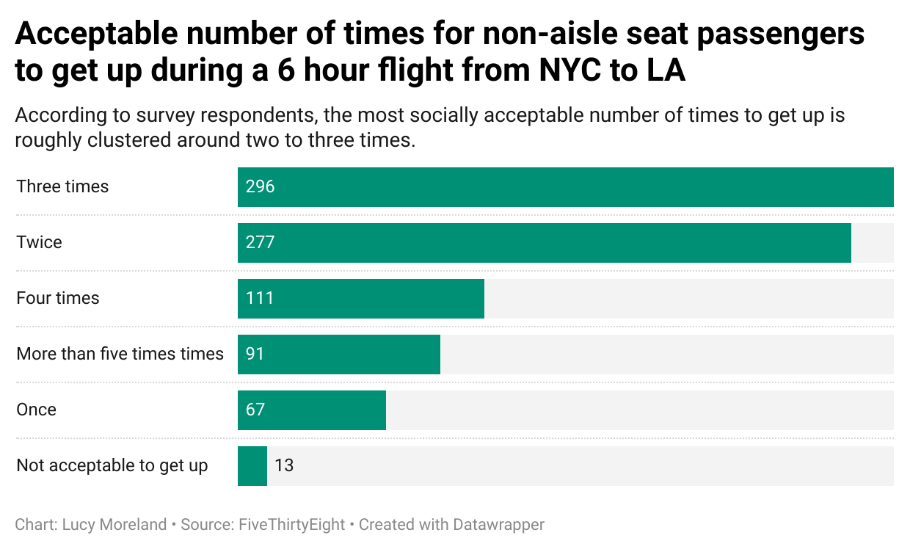

# j124-week-4-quiz

## Why I chose the question "On a 6 hour flight from NYC to LA, how many times is it acceptable to get up if you're not in an aisle seat?"

A year ago I was on a flight going from San Francisco to Berlin. It was about 9 hours, and I was in a window seat. I only needed to get up to use the restroom once, but the person next to me got up several more times.

I'm curious to see how often people feel it's necessary (or socially acceptable) to get up during a long flight. 

In terms of what I found interesting about this dataset, I was a little shocked to see "three times" as the most common response to the question. In my opinion, that's a lot of times to get up for a 6 hour flight. However, if I were in the aisle seat, I wouldn't be upset if the person seated next to me got up that many times. I was also surprised that "once" was such an uncommon response. I thought that'd be higher than 5+ times, for sure.

## My chart

Here's by chart:  

My chart shows that getting up **twice** and **three** times are roughly tied at the top in terms of social acceptability. Getting up **zero times** and just **once** rank at the bottom, illustrating that maybe people are more understanding and compassionate than my cynical heart thought they'd be.
